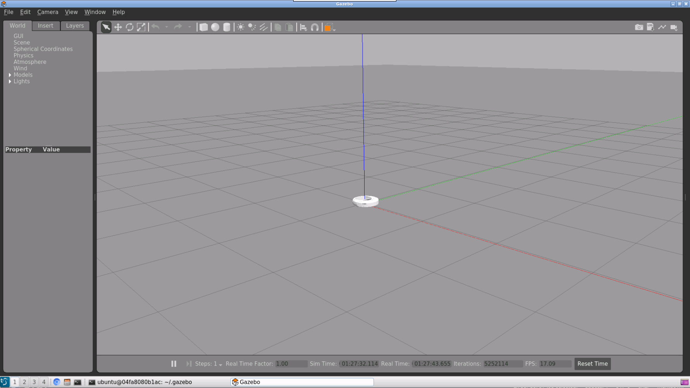
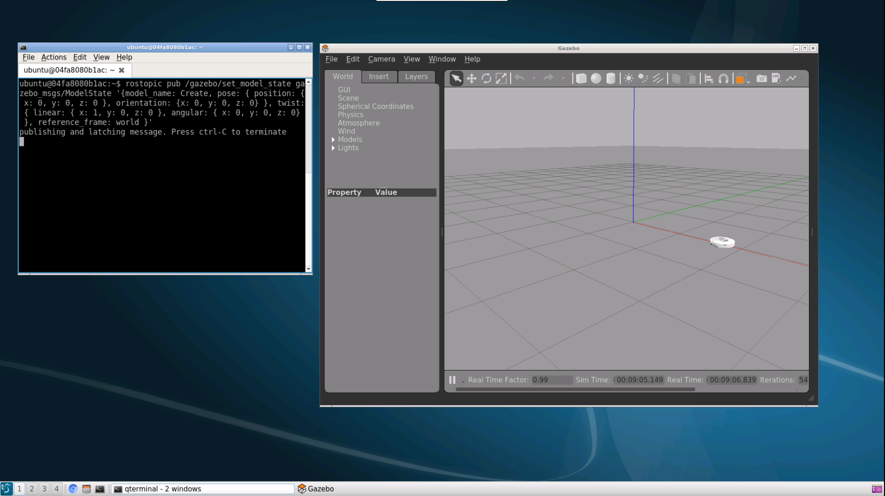
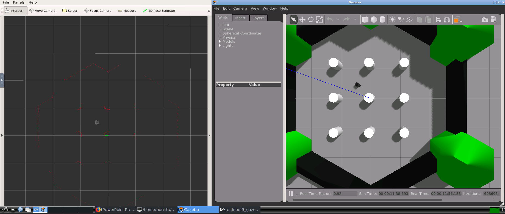

# Running ROS and Gazebo on an Ubuntu Desktop via Docker

This Dockerfile will install ROS Kinetic with Gazebo 7 on Ubuntu 16.04, and give you a VNC interface to work within that environment. The container is tested and working on Windows 10 and Mac OS X. To install:

    git clone https://github.com/jbnunn/ROSGazeboDesktop -b kinetic
    cd ROSGazeboDesktop
    docker build -t ros-gazebo-desktop:kinetic .
    
## Start and Connect to The Container

To effectively work with the container and save your data, we specify a workspace volume on your host with the `-v` flag.

Work you do in the container's `~/data` directory will be saved to your local `data` directory. On your host, create a `data` directory:

    mkdir data

Now when launching the container, we'll use the `-v` flag to mount `data` inside the container at `/home/ubuntu/data`.

### Windows

    docker run -it --rm --name=ros_gazebo_desktop -m=4g -p 6080:80 -p 5900:5900 -v %cd%/data:/home/ubuntu/data -e RESOLUTION=1920x1080 -e USER=ubuntu -e PASSWORD=ubuntu ros-gazebo-desktop:kinetic

### OS X / Linux:

    docker run -it --rm --name=ros_gazebo_desktop -m=4g -p 6080:80 -p 5900:5900 -v $PWD/data:/home/ubuntu/data -e RESOLUTION=1920x1080 -e USER=ubuntu -e PASSWORD=ubuntu ros-gazebo-desktop:kinetic   

We also expose port 5900 so you can connect with a VNC client, and/or port 6080 so you can connect via your browser using NoVNC. You can change the `RESOLUTION` to match screen dimensions appropriate for your display, and the `USER` environment variable to change the user that logs into the desktop. In most cases, you'll want to leave this as the `ubuntu` user (password `ubuntu`). 

Once the `docker run` command finishes running, connect to the container using a VNC client or via http://locahost:6080/. From the Ubuntu desktop, open a terminal, and try:

    roslaunch gazebo_ros empty_world.launch 
    
This will launch the Gazebo virtual world simulator with a default, empty world. Let's spawn the ["Create" robot from iRobot](https://www.irobot.com/about-irobot/stem/create-2), which is based off the Roomba platform. Open a new terminal, then:

    rosrun gazebo_ros spawn_model -file ~/.gazebo/models/create/model-1_4.sdf -sdf -model Create

You should see `Spawn status: SpawnModel: Successfully spawned entity`. Switch views back to Gazebo and you'll find the Create robot in your virtual world. It should look similar to the following.

There are other worlds you can launch:

    roslaunch gazebo_ros willowgarage_world.launch
    roslaunch gazebo_ros mud_world.launch
    roslaunch gazebo_ros shapes_world.launch
    roslaunch gazebo_ros rubble_world.launch

Take a look at the syntax at [http://gazebosim.org/tutorials?tut=ros_roslaunch](http://gazebosim.org/tutorials?tut=ros_roslaunch) for details on other launch options.

### Make the robot move

In a new terminal, list the currently available ROS topics:

    $ rostopic list

    /clock
    /gazebo/link_states
    /gazebo/model_states
    /gazebo/parameter_descriptions
    /gazebo/parameter_updates
    /gazebo/set_link_state
    /gazebo/set_model_state
    /rosout

We can manipulate the Create robot by sending a message to `model_state`. Publish a message to that topic:

    rostopic pub /gazebo/set_model_state gazebo_msgs/ModelState '{model_name: Create, pose: { position: { x: 0, y: 0, z: 0 }, orientation: {x: 0, y: 0, z: 0} }, twist: { linear: { x: 1, y: 0, z: 0 }, angular: { x: 0, y: 0, z: 0}  }, reference_frame: world }'

This command:

1) Publishes a topic to the set_model_state topic of type `gazebo_msgs/ModelState`
2) Contains the model name we specifed when we spawned the robot, `Create`
3) Specifies an initial "pose" *x, y, z* position of `(0, 0, 0)`, and an initial orientation of `(0, 0, 0)`
4) Specifies a "twist" component that tells it to move along the *x* axis
5) Tells the topic that all of this happens in our `world` reference frame

    
## Turtlebot

TurtleBot is a platform robot that makes learning principles of robotics--espeically within ROS--easier to learn. You can find many Turtlebot tutorials to help you get up to speed. The standard Turtlebot packages are installed by default in this Dockerfile. You can get started by following along the instructions at [http://emanual.robotis.com/docs/en/platform/turtlebot3/pc_setup/](http://emanual.robotis.com/docs/en/platform/turtlebot3/pc_setup/). Since the packages have already been installed, you can begin with the following (note the substitution of `catkin_ws` with `data`):

    mkdir -p ~/data/src
    cd ~/data/src/
    git clone https://github.com/ROBOTIS-GIT/turtlebot3_msgs.git
    git clone https://github.com/ROBOTIS-GIT/turtlebot3.git

Though not listed in the above link, you'll also need to add the `turtlebot3_simulation` package:

    git clone https://github.com/ROBOTIS-GIT/turtlebot3_simulations.git
    cd ~/data && catkin_make
    export TURTLEBOT3_MODEL=burger
    source devel/setup.bash

You should now be able to run the following, which will show the Turtlebot navigating autonomously in a virtual world. Gazebo will open and show a 3D representation of the world, and Rviz will show you a point point map based off a simulated laser system.

You will need three terminals to run the following:

    # Terminal 1: Launch Gazebo
    roslaunch turtlebot3_gazebo turtlebot3_world.launch

    # Terminal 2: Start the Turtlebot
    roslaunch turtlebot3_gazebo turtlebot3_simulation.launch

    # Terminal 3: Start Rviz
    roslaunch turtlebot3_gazebo turtlebot3_gazebo_rviz.launch

You can also follow Robotis tutorials on things like [SLAM](http://emanual.robotis.com/docs/en/platform/turtlebot3/slam/#slam), [Navigation](http://emanual.robotis.com/docs/en/platform/turtlebot3/navigation/#navigation), [Manipulation](http://emanual.robotis.com/docs/en/platform/turtlebot3/manipulation/#manipulation), [Autonomous Driving](http://emanual.robotis.com/docs/en/platform/turtlebot3/autonomous_driving/#autonomous-driving), [Machine Learning](http://emanual.robotis.com/docs/en/platform/turtlebot3/machine_learning/), and more.

## Other Robot Models and Considerations

* Many OSRF robot and models can be downloaded to your Docker container, and can be found at [https://bitbucket.org/osrf/gazebo_models/src/default/](https://bitbucket.org/osrf/gazebo_models/src/default/). 

         hg clone https://bitbucket.org/osrf/gazebo_models ~/.gazebo/models

* If you continue your experiments with the Create model, look at [https://gist.github.com/eddiem3/4f257b769d53c492b7ea0dc482cd7caa](https://gist.github.com/eddiem3/4f257b769d53c492b7ea0dc482cd7caa) or [http://guitarpenguin.is-programmer.com/posts/58100.html](http://guitarpenguin.is-programmer.com/posts/58100.html) for info on adding a differential-drive plugin.

## Wrap

You now have a working robotic simulation environment. [Visual Studio Code](https://code.visualstudio.com/) is available to you under the "Programming" menu item if you need a nice IDE. Don't forget that your work will not be saved unless you are working from the `/home/ubuntu/data` folder (or other folder(s) you mount with the `-v` flag.)

## Troubleshooting

### Gazebo is slow or processes hang

This is likely a memory issue. Launch your container with more RAM, 4GB for example, with the `-m=4g` flag. Your default Docker installation might be set to something lower, see [here to change those settings](https://stackoverflow.com/questions/44533319/how-to-assign-more-memory-to-docker-container).

## Credits

Based on the following work:

* Docker file for ROS + Gazebo setup: [https://github.com/bpinaya/robond-docker](https://github.com/bpinaya/robond-docker)
* LXDE Desktop: [https://hub.docker.com/r/dorowu/ubuntu-desktop-lxde-vnc/](https://hub.docker.com/r/dorowu/ubuntu-desktop-lxde-vnc/)