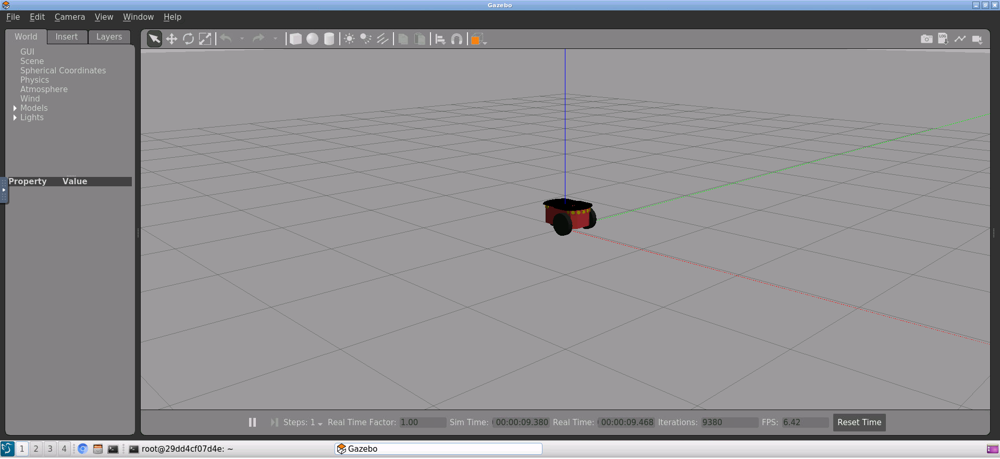
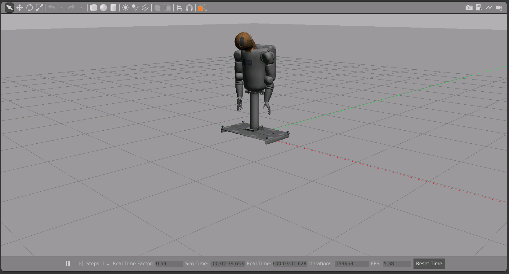

# Running ROS and Gazebo on an Ubuntu Desktop via Docker

This Dockerfile will install ROS Melodic with Gazebo 9 on Ubuntu 18.04, and give you a VNC interface to work within that environment. The container is tested and working on Windows 10 and Mac OS X. To install:

    git clone https://github.com/jbnunn/ROSGazeboDesktop
    cd ROSGazeboDesktop
    docker build -t ros-gazebo-desktop .
    
## Test your installation

Start the image and expose port 5900 so you can connect with a VNC client, and/or port 6080 so you can connect via your browser using NoVNC. We'll also expose port 11311 for the ROS master node which we'll need later if we want to communicate to the ROS core and control simualted robots from outside the Docker container. You can change the `RESOLUTION` to match a mode appropriate for your display.

    docker run -it --rm --name=ros_gazebo_desktop -p 6080:80 -p 5900:5900 -p 11311:1131 -e RESOLUTION=1920x1080

Connect to the container using a VNC client or via http://locahost:6080/. From the Ubuntu desktop, open a terminal, and try:

    gazebo worlds/pioneer2dx.world

This should open Gazebo with a simple virtual world and robot:

Experiment with more worlds by taking a look at the available ones via

    ls /usr/share/gazebo-9/worlds

You can also launch a world with

    roslaunch gazebo_ros empty_world.launch

## Launch a Robot into Gazebo

If Gazebo isn't running, launch it with `roslaunch gazebo_ros empty_world.launch`. Let's spawn a robot into this world. I'll use the ["Create" robot from iRobot](https://www.irobot.com/about-irobot/stem/create-2), which is based off the Roomba platform:

    rosrun gazebo_ros spawn_model -file ~/.gazebo/models/create/model-1_4.sdf -sdf -model Create

You should see `Spawn status: SpawnModel: Successfully spawned entity`. Switch views back to Gazebo and you'll find the Create robot in your virtual world.  

Take a look at the syntax at [http://gazebosim.org/tutorials?tut=ros_roslaunch](http://gazebosim.org/tutorials?tut=ros_roslaunch) for more details.

## Persisting Data

To effectively work with the container and save your data, we'll create a workspace volume on your host that is effectively shared with the container.

    mkdir ros_ws

Now when launching the container, we'll use the `-v` flag to mount `ros_ws` inside the container at `/root/ros_ws`. **Note**: The command below tries to launch your container with 4GB of RAM (`-m=4g`). Your default Docker installation might not allow that, see [here to changes those settings](https://stackoverflow.com/questions/44533319/how-to-assign-more-memory-to-docker-container).

* Windows:

        docker run -it --rm --name=ros_gazebo_desktop -p 6080:80 -p 5900:5900 -p 11311:11311 -v %cd%/ros_ws:/root/ros_ws -m=4g -e RESOLUTION=1920x1080 ros-gazebo-desktop

* OS X / Linux:

        docker run -it --rm --name=ros_gazebo_desktop -p 6080:80 -p 5900:5900 -p 11311:11311 -v $PWD/ros_ws:/root/ros_ws -m=4g -e RESOLUTION=1920x1080 ros-gazebo-desktop    

## Tutorial: Controlling a Robot from Your Host Machine

### Start the container and connect to it

If you haven't yet, start the container with a volume mounted on your host as described above. Connect to the container via VNC (or NoVNC in your browser).

### Start a virtual world and launch a robot into it

In the Ubuntu desktop, open a terminal, and launch an empty world:

    roslaunch gazebo_ros empty_world.launch

Open another terminal and launch a robot into it. We'll use a humanoid bot called _Robonaut_ (or _R2_), which is a virtualized version of a [robot that lives on board the International Space Station](https://robonaut.jsc.nasa.gov/R2/).

    rosrun gazebo_ros spawn_model -file ~/.gazebo/models/robonaut/model-1_4.sdf -sdf -model robonaut

You should see the robot spawned into the virtual world:

### Make the robot move

TBD

## Other Robot Models and Considerations

* A complete list of the OSRF robots downloaded to your Docker container can be found at [https://bitbucket.org/osrf/gazebo_models/src/default/](https://bitbucket.org/osrf/gazebo_models/src/default/). 
* If you continue your experiments with the Create model, look at [https://gist.github.com/eddiem3/4f257b769d53c492b7ea0dc482cd7caa](https://gist.github.com/eddiem3/4f257b769d53c492b7ea0dc482cd7caa) or [http://guitarpenguin.is-programmer.com/posts/58100.html](http://guitarpenguin.is-programmer.com/posts/58100.html) for info on adding a differential-drive plugin.

## Credits

Based on the following work:

* Dockerfile: [https://github.com/bpinaya/robond-docker](https://github.com/bpinaya/robond-docker)
* Docker base image: [https://hub.docker.com/r/dorowu/ubuntu-desktop-lxde-vnc/](https://hub.docker.com/r/dorowu/ubuntu-desktop-lxde-vnc/)